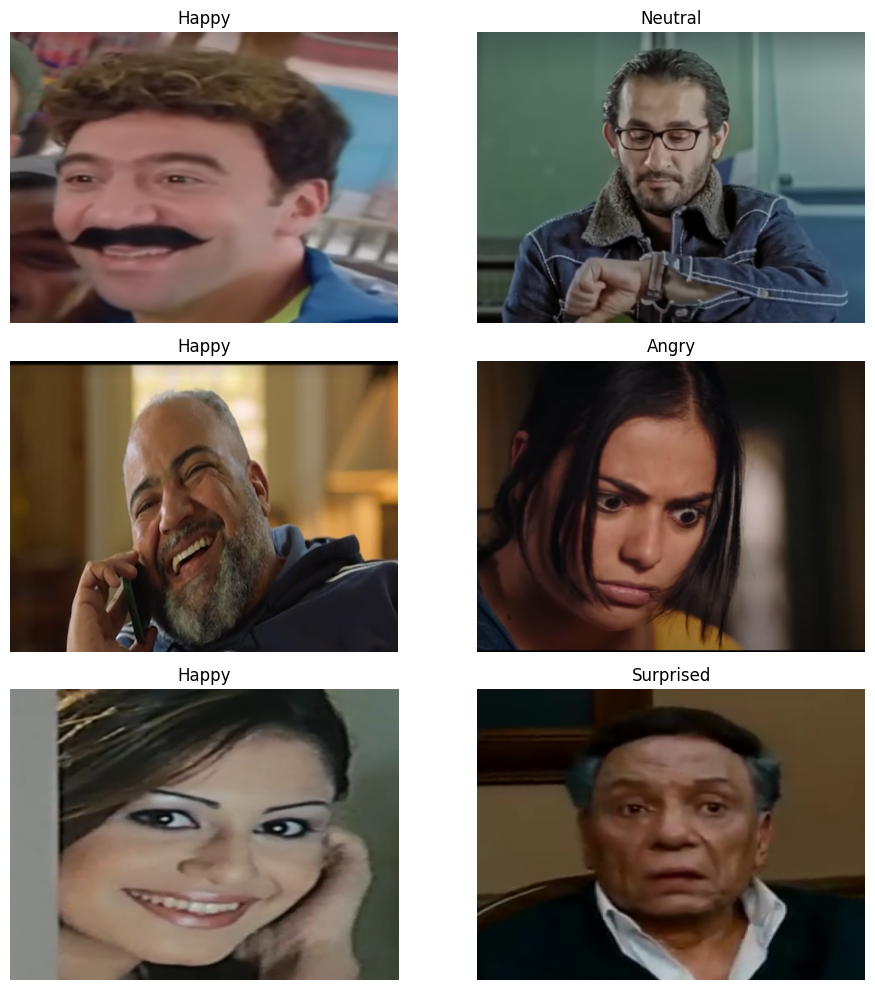

# Emotion-Vision
A convolutional neural network to classify emotion in frames taken from Egyptian movies into 5 classes:
- Happy
- Sad
- Angry
- Surprised
- Neutral

## 📄 Table of Contents

<!-- - [🚀 Tech Stack](#-tech-stack)
- [✨ Features](#-features) -->
- [🗄️ Dataset](#️-dataset)
- [🤖 CNN From Scratch (Model 1)](#-cnn-from-scratch-model-1)
<!-- - [🔗 REST API Endpoints](#-rest-api-endpoints)
- [🛠️ Setup Instructions](#️-setup-instructions)
- [📖 API Usage Examples](#-api-usage-examples)
- [📁 Project Structure](#-project-structure) -->

## 🗄️ Dataset

### Preprocessing Steps

1) Images were resized to 512 × 512 × 3.
2) Since OpenCV loads images in BGR format, all images were
converted to RGB.
3) Pixel values were normalized by dividing by 255.
4) The dataset was split into training, validation, and test sets in a 70 /
20 / 10 ratio. The following is a visualization for the classes per set: 
- Training Set:

- Validation Set:

- Testing Set:

5) The training set was augmented on the fly using the following transformations:
   - Random horizontal flip
   - Random vertical flips
   - Random rotations
   - Random brightness adjustments
   
   

### Post Processing Steps

1) Model 1 outputs the cluster number, and Model 2 outputs logits (or class probabilities).
2) ​Identify the index of the maximum logit (or probability) for model 2.
3) ​Map that index or the cluster number to its corresponding label using the class-label dictionary.

## CNN From Scratch (Model 1)

### Model Architecture

### Methodology

We explored two methods to assign a label to each cluster in order to compute the Accuracy and Confusion Matrix:

- Mode Assignment: For each cluster, we assigned the most frequent (mode) label among its members. If the most frequent label had already been assigned to another cluster, we selected the next most frequent label.

- Centroid Matching: We calculated the mean of the feature vectors for each label and used these means as centroids for label assignment.